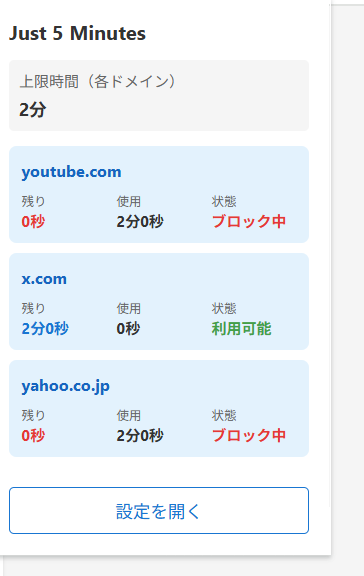
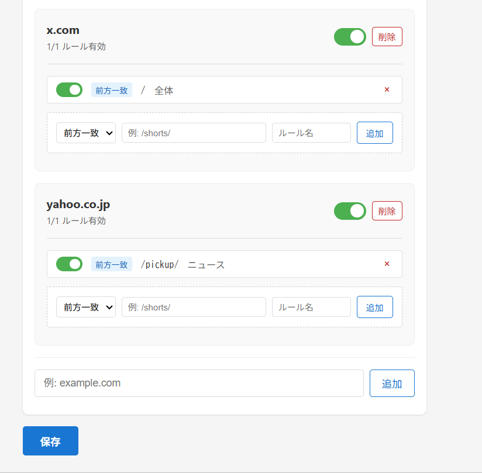
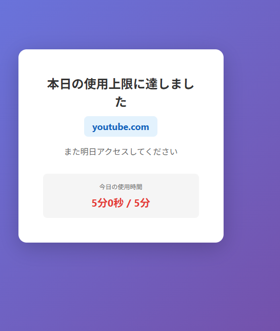

# Just 5 Minutes

A Chrome extension that limits daily browsing time on distracting websites.

Helps you control time spent on sites like YouTube Shorts and X (Twitter) that you tend to browse too much.

## Features

- Limit daily browsing time per domain
- Shows a block screen when the limit is reached
- Automatically resets at midnight
- Customizable domain and path rules

## Installation

### Development (Local)

1. Clone this repository
   ```bash
   git clone https://github.com/your-username/just-5-mins.git
   ```

2. Open `chrome://extensions` in Chrome

3. Enable "Developer mode"

4. Click "Load unpacked"

5. Select the cloned folder

## Usage

### Popup

Click the extension icon in the toolbar to check remaining time for each domain.



### Options

Open the options page from the "Open Settings" button in the popup, or from the extension's "Options" menu.



Available settings:

- **Daily Limit**: Maximum browsing time per day for each domain (in minutes)
- **Domain Management**: Add or remove domains to monitor
- **Path Rules**: Configure which paths to monitor within each domain

---

When the time limit is reached, a block screen is displayed:



### Default Settings

| Domain | Path Rule |
|--------|-----------|
| youtube.com | `/shorts/` (prefix match) |
| x.com | `/` (all paths) |

## Technical Details

- Manifest V3
- Service Worker (background processing)
- Content Script (in-page time tracking)
- chrome.storage.local (data persistence)
- chrome.scripting (dynamic script registration)

## File Structure

```
just-5-mins/
├── manifest.json       # Extension configuration
├── background.js       # Service Worker
├── content.js          # Content Script (time tracking)
├── popup.html/js/css   # Popup UI
├── options.html/js/css # Options page
├── blocked.html/js/css # Block screen
├── icons/              # Icons
```

## Disclaimer

This software is provided "as is", without warranty of any kind, express or implied. The author shall not be liable for any damages arising from the use of this software.

See the [LICENSE](LICENSE) file for details.

## License

MIT License

---

# Just 5 Minutes（日本語）

1日の閲覧時間を制限する Chrome 拡張機能です。

YouTube Shorts や X (Twitter) など、ついつい見すぎてしまうサイトの閲覧時間を制限できます。

## 機能

- ドメインごとに1日の閲覧時間を制限
- 上限に達するとブロック画面を表示
- 日付が変わると自動リセット
- ドメイン・パスルールのカスタマイズ

## インストール

### 開発版（ローカル）

1. このリポジトリをクローン
   ```bash
   git clone https://github.com/your-username/just-5-mins.git
   ```

2. Chrome で `chrome://extensions` を開く

3. 「デベロッパーモード」を有効化

4. 「パッケージ化されていない拡張機能を読み込む」をクリック

5. クローンしたフォルダを選択

## 使い方

### ポップアップ

ツールバーの拡張機能アイコンをクリックすると、各ドメインの残り時間を確認できます。


### 設定画面

ポップアップの「設定を開く」ボタン、または拡張機能の「オプション」から設定画面を開けます。


設定できる項目：

- **上限時間**: 各ドメインに適用される1日の上限時間（分）
- **ドメイン管理**: 監視対象のドメインを追加・削除
- **パスルール**: 各ドメイン内で監視するパスを設定


---

上限時間に達すると、以下のようなブロック画面が表示されます。


### デフォルト設定

| ドメイン | パスルール |
|----------|-----------|
| youtube.com | `/shorts/`（前方一致） |
| x.com | `/`（全体） |

## 技術仕様

- Manifest V3
- Service Worker（バックグラウンド処理）
- Content Script（ページ内時間計測）
- chrome.storage.local（データ永続化）
- chrome.scripting（動的スクリプト登録）

## ファイル構成

```
just-5-mins/
├── manifest.json       # 拡張機能の設定
├── background.js       # Service Worker
├── content.js          # Content Script（時間計測）
├── popup.html/js/css   # ポップアップUI
├── options.html/js/css # 設定画面
├── blocked.html/js/css # ブロック画面
├── icons/              # アイコン
```

## 免責事項

本ソフトウェアは、明示または黙示を問わず、いかなる保証も行いません。本ソフトウェアの使用によって生じたいかなる損害についても、作者は一切の責任を負いません。

詳細は [LICENSE](LICENSE) ファイルをご確認ください。

## ライセンス

MIT License
